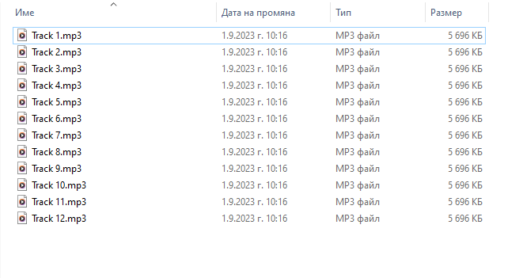
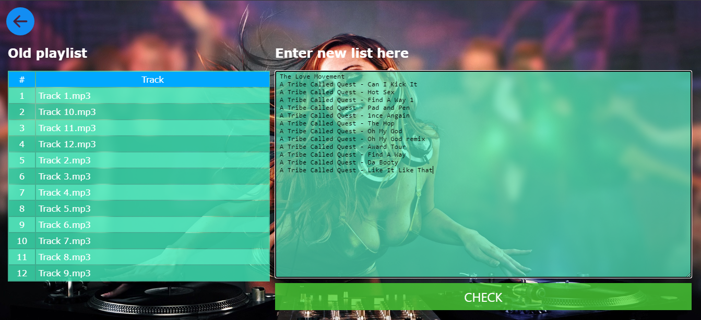
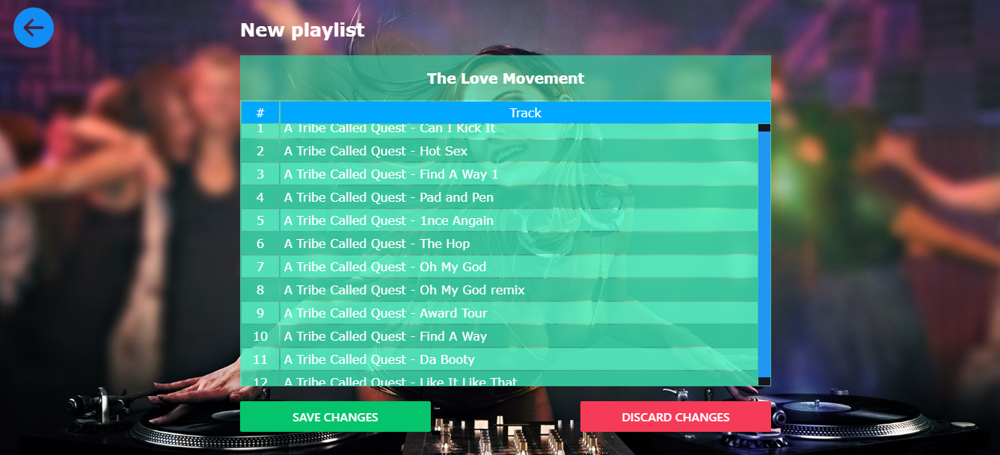
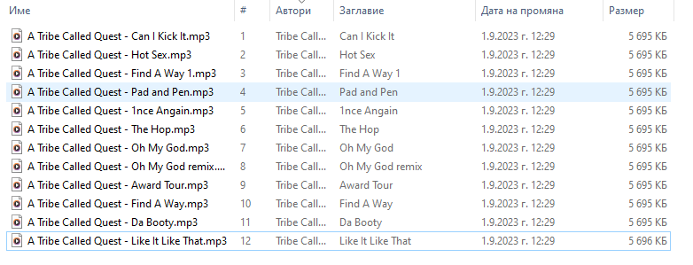

# A file renamer app

## Description

This app was made to help renaming mp3 files simultaneously.
Imagine you have a CD disc and when you rip the files on your computer
all files are named :
    Track 1.mp3
    Track 2.mp3
    ...........
    Track n.mp3
With this app you can navigate to the desired folder , enter the names you want
and save it.

## Requirement

- NodeJS

## Instalation

Clone the repo, or download a zip file , and place it to directory that will be the root directory for the app

Install all npm dependecies

```console
npm install
```

## Start the app

Let's say you place the app folder on the Desctop
Open the terminal and navigate to the root folder of the app 
( C:\Users\User-name\OneDrive\Desktop\playlist-maker/playlist-maker )
and run the command: 

```console
npm start
```
App can be accessed on http://localhost:3000

## How it works

If the app folder is on the Desktop when accessing http://localhost:3000 it will load
all files that are on the Desctop


In this example our song are in Music folder , so we click on that folder 


If we look in the folder it wood be like this:



Click on EDIT FILES button



In the text area under "Enter new list here" on the first line write the Album name
and on all ather lines enter the desired names for the songs. The lines for the songs
has to be as much as the songs count in the folder.
When ready click the check button



You will see example of how would be renamed the songs
From here you can choose wether to save the changes or not.

If saved check the Music folder you will see this:



All files are renamed, and it is added a ID3 tags for
- "#" 
- Author
- Title